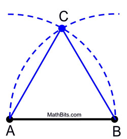
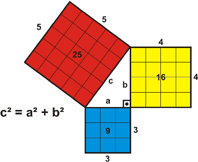

# Euclid's Elements
Written by Euclid in 300 B.C.

## Introduction: Definitions
Euclid introduces (how many?) definitions, most notably:
* A **point** is that which has no part.
* A **line** is that which has no length.
* The **extremeties** of a line are points.
* **Parallel lines** are those which do not meet if extended.

## Introduction: Axioms
Taken by Euclid to be self evident

1) Things which are equal to the same thing are also equal to one another.
2) The whole is greater than the part. 

## Introduction: Postulates
These are assumptions that Euclid lays as a foundation for his remaining constructions.

1) If you have any two points, you can always draw a line between them.
2) If you have a line, you are always allowed to extend it arbitrarily in either direction.
3) If you have two points, you can always draw a circle whose center is at one point, and whose edge intersects the second point.
4) Any two right angles are the same.
5) If you have a line, and a point not on the line, then there is exactly one line that is parallel to the line that runs through the point. This is called the **parallel postulate**, and famously acts as a gateway to non-Euclidean geometries.

## Book 1 - Proposition 1: Constructing Equilateral Triangles
Given two points, Euclid shows how to build an equilateral trangle using the intersection of two circles with centers and edges passing through the two points.

Euclid cheats a little, because he doesn't provide a postulate guaranteeing that these two circles actually meet. It appears obvious visually that they meet, but it isn't a logical consequence of the postulates.

## Book 1 - Proposition 47, 48: Pythagorean Theorem
Euclid visuallized the pythagorean theorem as the sum of the areas of three squares.
He called them Q1, Q2, and Q3, because the ancient Greeks used to like the word "quadrature". Propsition 48 is concerned with the inverse: If areas of such configured squares matches this description, the angle formed by Q1 and Q2 is a right angle.

